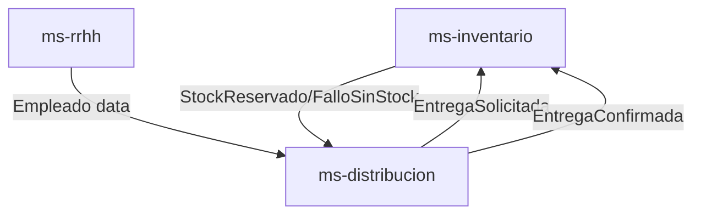

# Arquitectura de Microservicios para DelegInsumos

## Bounded Contexts

### ms-inventario
- **Responsabilidades**: Dueño del Aggregate Insumo. Gestiona stock, entradas y alertas de inventario.
- **Aggregate**: Insumo
- **Entities**: Insumo
- **Value Objects**: CantidadStock (actual, min, max), Nombre, Categoria
- **Domain Events**: StockAgotado, StockBajo, StockExceso, StockReservado, FalloSinStock
- **Domain Services**: ServicioValidacionStock, ServicioAjusteStock
- **Application Use Cases**: RegistrarInsumos, ConsultarInsumos, VerificarDisponibilidad

### ms-distribucion
- **Responsabilidades**: Dueño del Aggregate Entrega. Gestiona la transacción de salida de inventario.
- **Aggregate**: Entrega
- **Entities**: Entrega
- **Value Objects**: CantidadSolicitada, EstadoEntrega (PENDIENTE, CONFIRMADA)
- **Domain Events**: EntregaRegistrada, EntregaConfirmada
- **Domain Services**: ServicioEntrega
- **Application Use Cases**: RegistrarEntrega, ConfirmarEntrega

### ms-rrhh
- **Responsabilidades**: Dueño del Aggregate Empleado. Gestiona datos maestros de personal.
- **Aggregate**: Empleado
- **Entities**: Empleado
- **Value Objects**: Cedula, EstadoEmpleado (activo, inactivo)
- **Domain Events**: (Ninguno definido inicialmente)
- **Domain Services**: (Ninguno definido)
- **Application Use Cases**: ConsultarEmpleados

## Justification for Context Separation

### Separation of ms-distribucion from ms-inventario

The decision to separate ms-distribucion from ms-inventario is driven by Domain-Driven Design principles, where each bounded context encapsulates a specific domain model and business logic. ms-inventario is responsible for managing the inventory aggregate (Insumo), focusing on stock levels, validations, and alerts. In contrast, ms-distribucion owns the delivery aggregate (Entrega), handling the transactional aspects of inventory output, such as registering and confirming deliveries.

This separation prevents tight coupling between inventory management and distribution processes, allowing each service to evolve independently. For instance, changes to stock adjustment logic in ms-inventario do not impact delivery workflows in ms-distribucion, and vice versa. It also enables different scaling strategies: ms-inventario might require high availability for real-time stock checks, while ms-distribucion could scale based on delivery transaction volume.

### Benefits of Microservices Architecture

Adopting a microservices architecture provides several advantages:

- **Scalability**: Each service can be scaled independently based on its specific load. For example, if distribution transactions increase, only ms-distribucion needs additional resources.

- **Maintainability**: Smaller, focused codebases are easier to understand, test, and maintain. Teams can work on individual services without affecting others.

- **Fault Isolation**: Failures in one service do not cascade to others. If ms-rrhh experiences issues, inventory and distribution operations remain unaffected.

- **Technology Diversity**: Services can use different technologies or frameworks suited to their needs, promoting innovation and best-fit solutions.

- **Team Autonomy**: Cross-functional teams can own and deploy services independently, accelerating development cycles and reducing coordination overhead.

This architecture aligns with the subdomain classifications, treating inventory as the core domain, distribution as supporting, and HR as generic, ensuring strategic focus on business-critical areas.
## Subdomain Classifications

- Core Domain: ms-inventario
- Supporting Domain: ms-distribucion
- Generic Domain: ms-rrhh

## Context Map

- ms-distribucion → ms-inventario = Customer/Supplier
- ms-distribucion → ms-rrhh = Conformist
- ms-inventario offers inventory operations as an open host service

## Diagrama de Contexto



## Topología de Eventos JSON

### EntregaRegistrada
```json
{
"entrega_id": "uuid",
"empleado_id": "uuid",
"insumo_id": "uuid",
"cantidad": 5
}
```

### StockDescontado
```json
{
"insumo_id": "uuid",
"cantidad_descontada": 5,
"stock_actual": 5
}
```

### AlertaStockCritico
```json
{
"insumo_id": "uuid",
"tipo": "agotado|bajo|exceso",
"stock_actual": 0
}

## Data Model Diagrams

### ms-inventario

| Table  | Attributes |
|--------|------------|
| Insumo | id (UUID), nombre (string), categoria (string), stock_actual (int), stock_min (int), stock_max (int) |

### ms-distribucion

| Table   | Attributes |
|---------|------------|
| Entrega | id (UUID), empleado_id (UUID), insumo_id (UUID), cantidad (int), estado (string) |

### ms-rrhh

| Table    | Attributes |
|----------|------------|
| Empleado | id (UUID), cedula (string), estado (string) |

## Comunicación de Microservicios

- **ms-distribucion** se suscribe a los eventos **StockDescontado** y **AlertaStockCritico** de **ms-inventario**
- **ms-distribucion** publica los eventos **EntregaRegistrada** en **ms-inventario**
- **ms-distribucion** consulta los datos de los empleados en **ms-rrhh**
- **ms-distribucion** publica los eventos **EntregaConfirmada** en **ms-inventario**

## Flujo de Eventos

1. **ms-distribucion** publica el evento **EntregaRegistrada** en **ms-inventario**
2. **ms-inventario** procesa el evento y publica los eventos **StockDescontado** o **AlertaStockCritico**
3. **ms-distribucion** se suscribe a los eventos **StockDescontado** y **AlertaStockCritico**
4. **ms-distribucion** consulta los datos de los empleados en **ms-rrhh**
5. **ms-distribucion** publica el evento **EntregaConfirmada** en **ms-inventario**


## Diagrama de Flujo de Eventos

```mermaid
sequenceDiagram
    participant ms_distribucion
    participant ms_inventario
    participant ms_rrhh

    ms_distribucion->>ms_inventario: EntregaRegistrada
    ms_inventario->>ms_distribucion: StockDescontado
    ms_inventario->>ms_distribucion: AlertaStockCritico
    ms_distribucion->>ms_rrhh: Consulta Empleado
    ms_distribucion->>ms_inventario: EntregaConfirmada
    ms_rrhh-->>ms_distribucion: Datos Empleado
    ms_inventario-->>ms_distribucion: Stock Actualizado
    ms_inventario-->>ms_distribucion: Alerta Resuelta

    ms_distribucion->>ms_inventario: EntregaConfirmada
    ms_inventario-->>ms_distribucion: Entrega Confirmada
    ms_distribucion->>ms_rrhh: Consulta Empleado
    ms_rrhh-->>ms_distribucion: Datos Empleado
    ms_distribucion->>ms_inventario: EntregaConfirmada
    ms_inventario-->>ms_distribucion: Entrega Confirmada
    
    ms_distribucion->>ms_inventario: EntregaConfirmada
    ms_inventario-->>ms_distribucion: Entrega Confirmada
    ms_distribucion->>ms_rrhh: Consulta Empleado
    ms_rrhh-->>ms_distribucion: Datos Empleado
    ms_distribucion->>ms_inventario: EntregaConfirmada
    ms_inventario-->>ms_distribucion: Entrega Confirmada

    ms_distribucion->>ms_inventario: EntregaConfirmada
    ms_inventario-->>ms_distribucion: Entrega Confirmada
    ms_distribucion->>ms_rrhh: Consulta Empleado
    ms_rrhh-->>ms_distribucion: Datos Empleado
    ms_distribucion->>ms_inventario: EntregaConfirmada
    ms_inventario-->>ms_distribucion: Entrega Confirmada