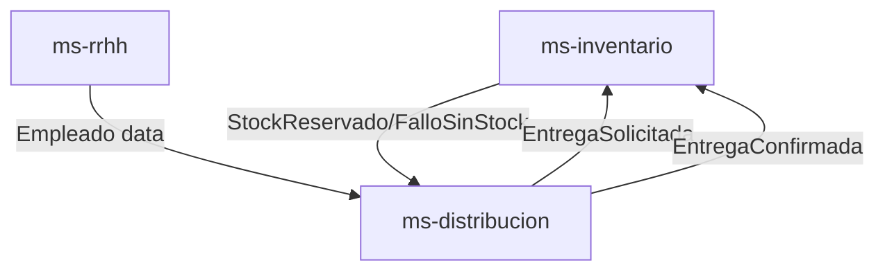

# Informe del Proyecto DDD - DelegInsumos

## Introducción

El proyecto "DelegInsumos" implementa una arquitectura de microservicios basada en los principios de Domain-Driven Design (DDD). El sistema está diseñado para gestionar la distribución de insumos en una organización, dividiendo las responsabilidades en servicios especializados: gestión de inventario (ms-inventario), recursos humanos (ms-rrhh), distribución (ms-distribucion) y una puerta de enlace API (ms-gateway).

La arquitectura sigue los principios de DDD para separar claramente las capas de dominio, aplicación e infraestructura, permitiendo una evolución independiente de cada servicio. Los servicios se comunican de manera asíncrona mediante RabbitMQ y comparten una base de datos PostgreSQL. El proyecto utiliza Docker y Docker Compose para facilitar el despliegue y la escalabilidad.

## Diseño DDD

### Bounded Contexts

#### ms-inventario
- **Responsabilidades**: Dueño del Aggregate Insumo. Gestiona stock, entradas y alertas de inventario.
- **Aggregate**: Insumo
- **Entities**: Insumo
- **Value Objects**: CantidadStock (actual, min, max), Nombre, Categoria
- **Domain Events**: StockAgotado, StockBajo, StockExceso, StockReservado, FalloSinStock
- **Domain Services**: ServicioValidacionStock, ServicioAjusteStock
- **Application Use Cases**: RegistrarInsumos, ConsultarInsumos, VerificarDisponibilidad

#### ms-distribucion
- **Responsabilidades**: Dueño del Aggregate Entrega. Gestiona la transacción de salida de inventario.
- **Aggregate**: Entrega
- **Entities**: Entrega
- **Value Objects**: CantidadSolicitada, EstadoEntrega (PENDIENTE, CONFIRMADA)
- **Domain Events**: EntregaRegistrada, EntregaConfirmada
- **Domain Services**: ServicioEntrega
- **Application Use Cases**: RegistrarEntrega, ConfirmarEntrega

#### ms-rrhh
- **Responsabilidades**: Dueño del Aggregate Empleado. Gestiona datos maestros de personal.
- **Aggregate**: Empleado
- **Entities**: Empleado
- **Value Objects**: Cedula, EstadoEmpleado (activo, inactivo)
- **Domain Events**: (Ninguno definido inicialmente)
- **Domain Services**: (Ninguno definido)
- **Application Use Cases**: ConsultarEmpleados

### Justificación de la Separación de Contextos

La separación de ms-distribucion de ms-inventario se basa en principios de DDD, donde cada contexto delimitado encapsula un modelo de dominio específico y lógica de negocio. ms-inventario es responsable de gestionar el agregado de inventario (Insumo), enfocándose en niveles de stock, validaciones y alertas. En contraste, ms-distribucion posee el agregado de entrega (Entrega), manejando los aspectos transaccionales de la salida de inventario, como registrar y confirmar entregas.

Esta separación previene el acoplamiento estrecho entre la gestión de inventario y los procesos de distribución, permitiendo que cada servicio evolucione independientemente. Por ejemplo, cambios en la lógica de ajuste de stock en ms-inventario no impactan los flujos de trabajo de entrega en ms-distribucion, y viceversa. También permite estrategias de escalado diferentes: ms-inventario podría requerir alta disponibilidad para verificaciones de stock en tiempo real, mientras que ms-distribucion podría escalar basado en el volumen de transacciones de entrega.

### Beneficios de la Arquitectura de Microservicios

Adoptar una arquitectura de microservicios proporciona varias ventajas:

- **Escalabilidad**: Cada servicio puede escalarse independientemente basado en su carga específica. Por ejemplo, si las transacciones de distribución aumentan, solo ms-distribucion necesita recursos adicionales.
- **Mantenibilidad**: Codebases más pequeñas y enfocadas son más fáciles de entender, probar y mantener. Los equipos pueden trabajar en servicios individuales sin afectar a otros.
- **Aislamiento de Fallos**: Las fallas en un servicio no se propagan a otros. Si ms-rrhh experimenta problemas, las operaciones de inventario y distribución permanecen inafectadas.
- **Diversidad Tecnológica**: Los servicios pueden usar diferentes tecnologías o frameworks adecuados a sus necesidades, promoviendo la innovación y soluciones óptimas.
- **Autonomía de Equipos**: Equipos multifuncionales pueden poseer y desplegar servicios independientemente, acelerando ciclos de desarrollo y reduciendo sobrecarga de coordinación.

Esta arquitectura se alinea con las clasificaciones de subdominios, tratando el inventario como dominio core, distribución como supporting, y RRHH como generic, asegurando enfoque estratégico en áreas críticas para el negocio.

### Clasificaciones de Subdominios

- Core Domain: ms-inventario
- Supporting Domain: ms-distribucion
- Generic Domain: ms-rrhh

### Context Map

- ms-distribucion → ms-inventario = Customer/Supplier
- ms-distribucion → ms-rrhh = Conformist
- ms-inventario ofrece operaciones de inventario como un servicio de host abierto

## Diagramas

### Diagrama de Contexto



### Topología de Eventos JSON

#### EntregaRegistrada
```json
{
  "entrega_id": "uuid",
  "empleado_id": "uuid",
  "insumo_id": "uuid",
  "cantidad": 5
}
```

#### StockDescontado
```json
{
  "insumo_id": "uuid",
  "cantidad_descontada": 5,
  "stock_actual": 5
}
```

#### AlertaStockCritico
```json
{
  "insumo_id": "uuid",
  "tipo": "agotado|bajo|exceso",
  "stock_actual": 0
}
```

### Data Model Diagrams

#### ms-inventario

| Table  | Attributes |
|--------|------------|
| Insumo | id (UUID), nombre (string), categoria (string), stock_actual (int), stock_min (int), stock_max (int) |

#### ms-distribucion

| Table   | Attributes |
|---------|------------|
| Entrega | id (UUID), empleado_id (UUID), insumo_id (UUID), cantidad (int), estado (string) |

#### ms-rrhh

| Table    | Attributes |
|----------|------------|
| Empleado | id (UUID), cedula (string), estado (string) |

## Código Fuente

### Entidades y Objetos de Valor (ms-inventario)

```python
# ms-inventario/src/domain/entities.py
from uuid import UUID

from .value_objects import CantidadStock, Nombre, Categoria

class Insumo:
    def __init__(self, id_: UUID, nombre: Nombre, categoria: Categoria, stock: CantidadStock):
        self.id = id_
        self.nombre = nombre
        self.categoria = categoria
        self.stock = stock

    def verificar_disponibilidad(self, cantidad: int) -> bool:
        return self.stock.actual >= cantidad

    def descontar_stock(self, cantidad: int) -> None:
        if cantidad > self.stock.actual:
            raise ValueError("Insufficient stock")
        self.stock = CantidadStock(
            actual=self.stock.actual - cantidad,
            min_=self.stock.min,
            max_=self.stock.max
        )

    def es_stock_critico(self) -> str:
        if self.stock.actual == 0:
            return "agotado"
        elif self.stock.actual < self.stock.min:
            return "bajo"
        elif self.stock.actual > self.stock.max:
            return "exceso"
        return "normal"
```

```python
# ms-inventario/src/domain/value_objects.py
from typing import NamedTuple

class CantidadStock(NamedTuple):
    actual: int
    min: int
    max: int

    def __new__(cls, actual: int, min_: int, max_: int):
        if actual < 0 or min_ < 0 or max_ < 0:
            raise ValueError("Stocks cannot be negative")
        return super().__new__(cls, actual, min_, max_)

class Nombre(str):
    def __new__(cls, value: str):
        if not value.strip():
            raise ValueError("Nombre cannot be empty")
        return super().__new__(cls, value.strip())

class Categoria(str):
    def __new__(cls, value: str):
        if not value.strip():
            raise ValueError("Categoria cannot be empty")
        return super().__new__(cls, value.strip())
```

### Eventos de Dominio (ms-inventario)

```python
# ms-inventario/src/domain/events.py
from dataclasses import dataclass
from uuid import UUID

@dataclass
class DomainEvent:
    insumo_id: UUID

@dataclass
class StockAgotado(DomainEvent):
    pass

@dataclass
class StockBajo(DomainEvent):
    pass

@dataclass
class StockExceso(DomainEvent):
    pass

@dataclass
class StockReservado(DomainEvent):
    cantidad: int

@dataclass
class FalloSinStock(DomainEvent):
    cantidad_solicitada: int
```

### Casos de Uso (ms-inventario)

```python
# ms-inventario/src/application/use_cases.py
from uuid import UUID

from domain.entities import Insumo
from domain.repositories import InsumoRepository
from domain.value_objects import CantidadStock, Nombre, Categoria

class RegistrarInsumos:
    def __init__(self, repo: InsumoRepository):
        self.repo = repo

    def execute(self, id_: UUID, nombre: str, categoria: str, stock_actual: int, stock_min: int, stock_max: int) -> Insumo:
        nombre_vo = Nombre(nombre)
        categoria_vo = Categoria(categoria)
        stock_vo = CantidadStock(stock_actual, stock_min, stock_max)
        insumo = Insumo(id_, nombre_vo, categoria_vo, stock_vo)
        self.repo.save(insumo)
        return insumo

class ConsultarInsumos:
    def __init__(self, repo: InsumoRepository):
        self.repo = repo

    def execute(self, id_: UUID) -> Insumo:
        return self.repo.get_by_id(id_)

class VerificarDisponibilidad:
    def __init__(self, repo: InsumoRepository):
        self.repo = repo

    def execute(self, id_: UUID, cantidad: int) -> bool:
        insumo = self.repo.get_by_id(id_)
        return insumo.verificar_disponibilidad(cantidad)
```

### Entidades y Objetos de Valor (ms-rrhh)

```python
# ms-rrhh/src/domain/entities.py
from uuid import UUID

from .value_objects import Cedula, EstadoEmpleado

class Empleado:
    def __init__(self, id_: UUID, cedula: Cedula, estado: EstadoEmpleado):
        self.id = id_
        self.cedula = cedula
        self.estado = estado

    def es_activo(self) -> bool:
        return self.estado == "activo"
```

```python
# ms-rrhh/src/domain/value_objects.py
class Cedula(str):
    def __new__(cls, value: str):
        if not value.strip():
            raise ValueError("Cedula cannot be empty")
        return super().__new__(cls, value.strip())

class EstadoEmpleado(str):
    def __new__(cls, value: str):
        if value not in ["activo", "inactivo"]:
            raise ValueError("Estado must be activo or inactivo")
        return super().__new__(cls, value)
```

## Frontend - Dashboard Unificado

El frontend ha sido completamente refactorizado en un dashboard unificado desarrollado con tecnologías web modernas (HTML5, CSS3, JavaScript ES6+). Esta interfaz de usuario proporciona una experiencia cohesiva para la gestión completa del sistema DelegInsumos.

### Características Principales

#### Vista Unificada
- **Dashboard Principal**: Una sola página que consolida todas las funcionalidades operativas.
- **Métricas en Tiempo Real**: Cards con indicadores clave (Valor Insumos, Empleados Activos, Entregas Hoy, Alertas Stock).
- **Navegación Simplificada**: Eliminación de navegación lateral compleja, enfocada en eficiencia operativa.

#### Gestión de Recursos
- **Insumos**: Visualización de stock con estados coloreados, CRUD completo, actualización manual de stock.
- **Empleados**: Gestión de personal con toggle de estado activo/inactivo, colores por estado.
- **Entregas**: Creación y confirmación de entregas con validación automática de stock disponible.

#### Interfaz de Usuario Avanzada
- **Estados Visuales**: Sistema de colores en filas de tablas para identificación rápida de estados:
  - Insumos: Rojo (sin stock), Naranja (crítico), Verde (OK), Azul (exceso)
  - Empleados: Verde (activo), Gris (inactivo)
  - Entregas: Amarillo (pendiente), Verde (confirmada)
- **Modales Interactivos**: Formularios emergentes para creación y edición con validaciones.
- **Responsive Design**: Adaptable a diferentes tamaños de pantalla.
- **UX Moderna**: Animaciones sutiles, feedback visual y navegación intuitiva.

#### Integración Backend
- **API Gateway**: Comunicación directa con el gateway para todas las operaciones CRUD.
- **Validaciones del Lado Cliente**: Verificación de stock antes de confirmar entregas.
- **Actualización Automática**: Reducción de stock al confirmar entregas exitosamente.

### Arquitectura Frontend

- **HTML Semántico**: Estructura clara con secciones lógicas.
- **CSS Modular**: Estilos organizados con variables CSS para consistencia.
- **JavaScript Asíncrono**: Fetch API para comunicación con backend, manejo de promesas.
- **Separación de Responsabilidades**: Lógica de UI separada de lógica de negocio.

## Conclusiones

La implementación completa del proyecto "DelegInsumos" combina Domain-Driven Design en el backend con una interfaz de usuario moderna y funcional en el frontend. La arquitectura de microservicios asegura escalabilidad y mantenibilidad, mientras que el dashboard unificado proporciona una experiencia de usuario eficiente y visualmente atractiva.

Los beneficios clave incluyen:
- **Escalabilidad Independiente**: Servicios backend escalan según necesidades específicas.
- **Mantenibilidad Mejorada**: Separación clara entre frontend y backend.
- **Experiencia de Usuario**: Dashboard intuitivo con feedback visual en tiempo real.
- **Validaciones Robustas**: Verificaciones de negocio tanto en frontend como backend.
- **Preparación para Futuro**: Arquitectura preparada para expansiones y nuevas funcionalidades.

Esta implementación demuestra las mejores prácticas de desarrollo full-stack, alineando el código con el dominio del negocio y proporcionando una base sólida para aplicaciones empresariales distribuidas.